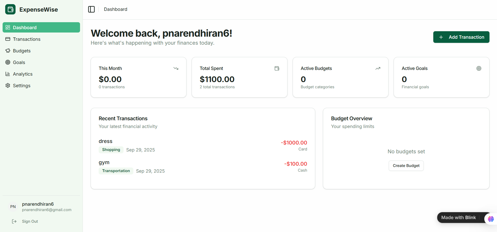

# vibe-coding-hands-on

## The Name of the website:
```
Expense Tracker
```

## The prompt:

```
Prompt:

1. Application : Enhanced Prompt for Expense Tracker Application

"Build a Expense Tracker Application with the following features:

Core Features:

- User Authentication & Profiles

- Signup/login with email, social logins, or biometric authentication (if mobile).

- User profile with currency selection and time zone.

- Dark mode/light mode toggle.

Transaction Management:

Add, edit, delete transactions with fields: amount, category, sub-category, date, payment method, and notes.

Recurring transactions (e.g., monthly rent, subscriptions).

Receipt upload (image/pdf) with OCR to auto-fill transaction data.

Split transactions (e.g., share bills with friends).

Budgeting & Goals

Set monthly/weekly budgets for categories (e.g., $500 for food).

Alerts/notifications when nearing or exceeding budget.

Goal tracking (e.g., saving $2000 for vacation).

Analytics & Insights

Interactive charts (pie, bar, line) for category-wise and time-based expense tracking.

Trend analysis (weekly, monthly, yearly comparisons).

AI-powered insights: detect unusual spending, suggest savings.

Net worth tracker (assets vs. liabilities).

Search, Filters & Export

Search transactions by keyword, date range, or category.

Advanced filters (e.g., only "cash" transactions in June).

Export to CSV, Excel, or PDF.

Import bank statements or CSVs for bulk uploads.

Advanced Features

Multi-Currency Support with automatic exchange rate conversion.

Offline Mode with sync when back online.

Bank/Wallet Integration (Plaid, Stripe, or mock APIs) for auto-fetching transactions.

Recurring Reminders (e.g., bill due dates).

Multi-user / Family Accounts with shared budgets.

Customizable Categories & Tags.

Data Backup & Restore (Cloud + Local).

Two-Factor Authentication for security.

Tech Stack (Suggested)

Frontend: React (with Tailwind CSS & shadcn/ui for modern UI).

Backend: Node.js (Express) or Django REST API.

Database: PostgreSQL (for relational) or MongoDB (for flexibility).

Mobile Option: React Native / Flutter (if building cross-platform).

Testing: Jest, Cypress (frontend), Pytest/Jest (backend).

Deployment: Docker + CI/CD pipelines.

Design

Minimal, responsive UI with charts, cards, and dashboards.

Accessibility-first (screen reader & keyboard navigation).

Smooth animations (Framer Motion).

```

## A small part of the code 

```html
<!doctype html>
<html lang="en">
  <head>
    <meta charset="UTF-8" />
    <link rel="icon" type="image/svg+xml" href="/favicon.svg" />
    <meta name="viewport" content="width=device-width, initial-scale=1.0" />
    <title>Blink App</title>
    <!-- CRITICAL: DO NOT REMOVE/MODIFY THIS COMMENT OR THE SCRIPT BELOW -->
    <script src="https://blink.new/auto-engineer.js?projectId=expensewise-expense-tracker-bxy7txrn" type="module"></script>
  </head>
  <body>
    <div id="root"></div>
    <script type="module" src="/src/main.tsx"></script>
  </body>
</html> 

```

## A Window of the output:

